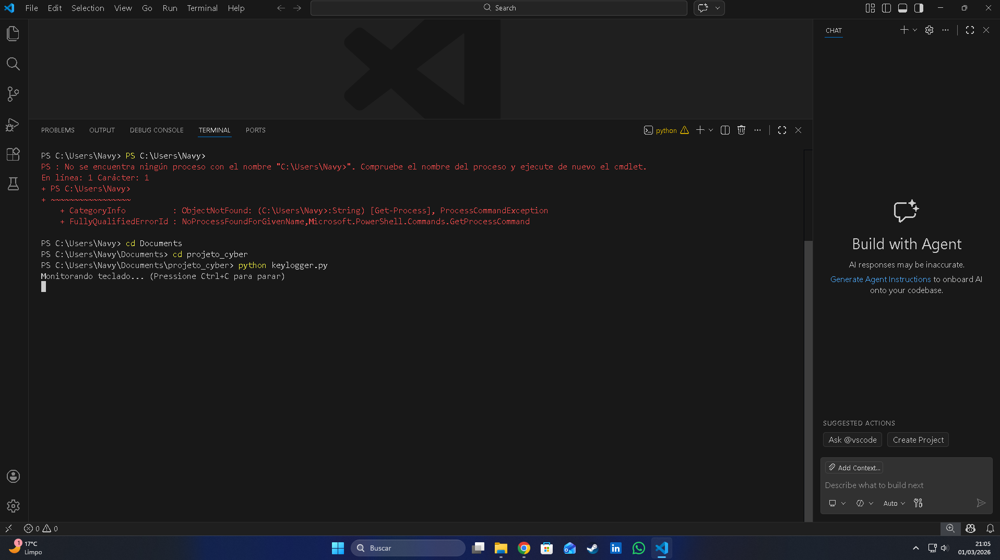
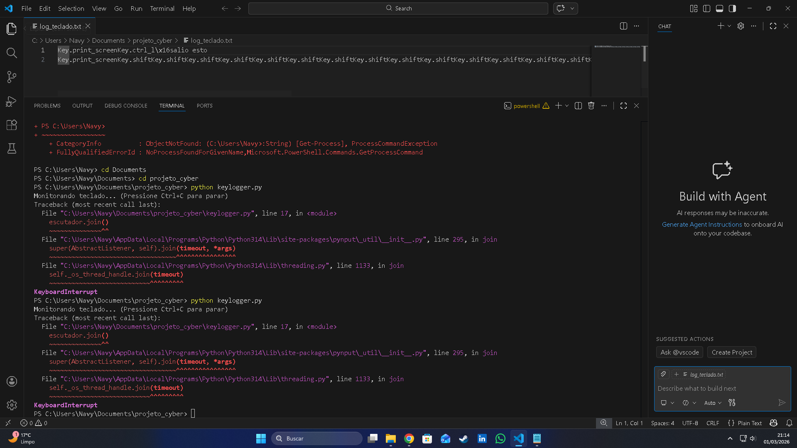
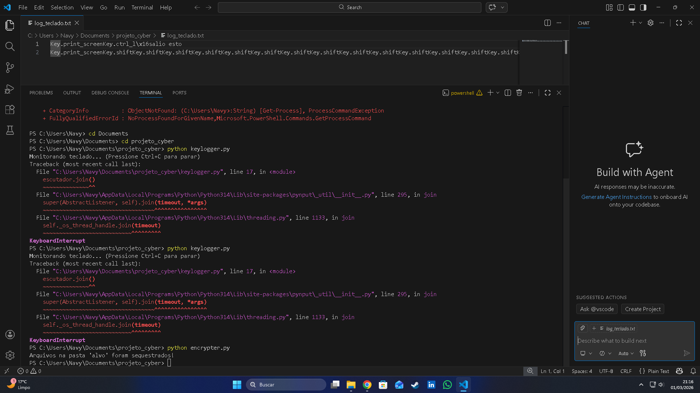
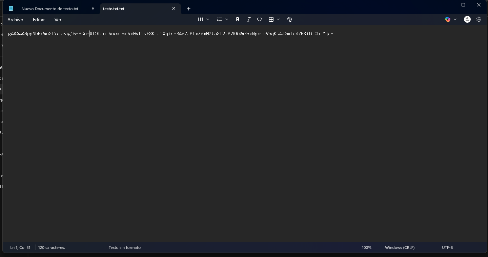
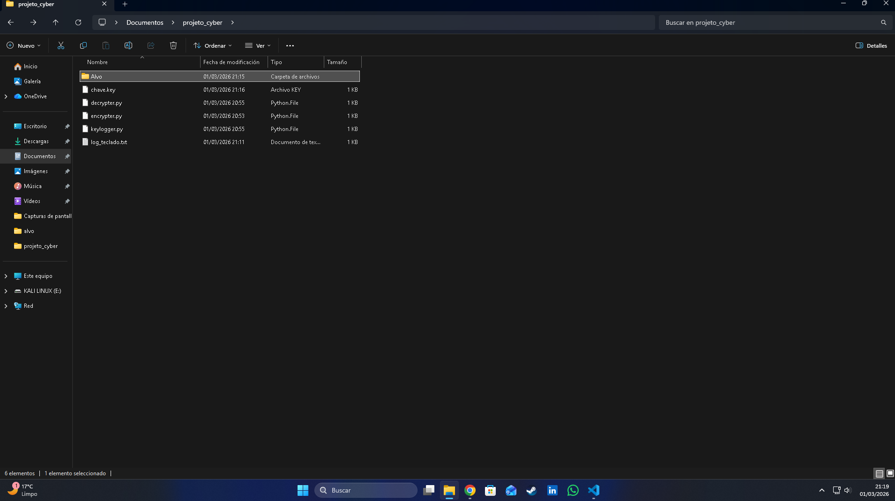
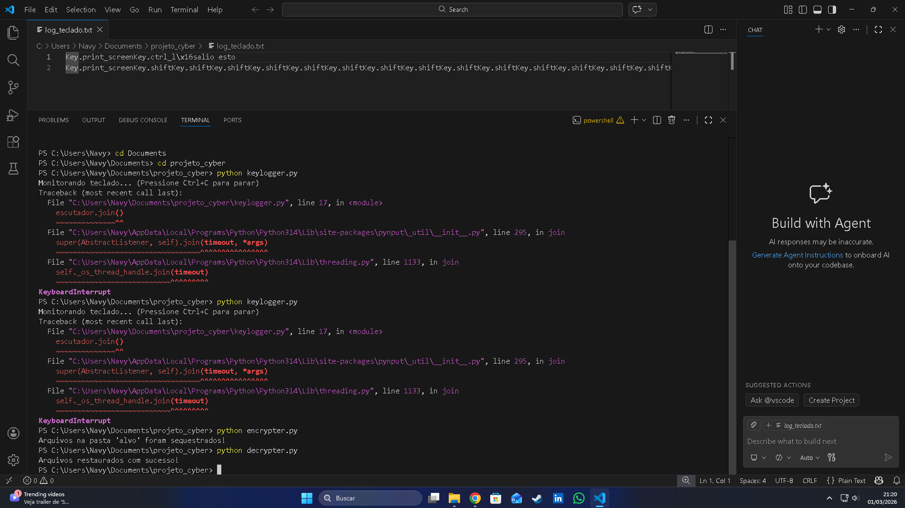
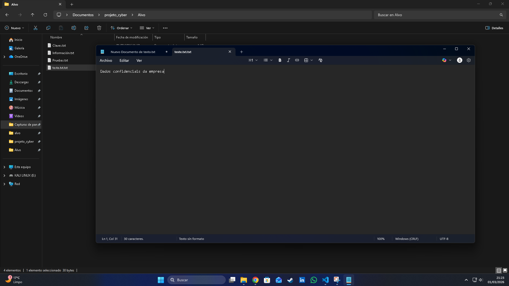

# python-security-lab-ransomware-keylogger

Projeto prático de Cybersecurity desenvolvido em Python.  
Implementação educacional de scripts de Keylogger e Ransomware (criptografia com Fernet) em ambiente controlado para estudo de vulnerabilidades, técnicas de persistência e recuperação de dados.

# 🛡️ Laboratório de Cybersecurity - Python

Projeto prático voltado ao estudo do comportamento de malwares e técnicas de remediação em ambiente controlado e seguro.

> ⚠️ Este projeto foi desenvolvido exclusivamente para fins educacionais e de pesquisa em segurança da informação.

---

## 📸 Evidências do Projeto

### 1️⃣ Monitoramento com Keylogger
O script captura entradas do teclado em tempo real para estudo de exfiltração de dados.

---

### 2️⃣ Simulação de Ransomware (Criptografia de Dados)
Demonstração da criptografia de arquivos em uma pasta alvo utilizando criptografia simétrica.

---

### 3️⃣ Recuperação e Gestão de Chaves
Uso da chave simétrica e script de remediação para restaurar os arquivos criptografados.

